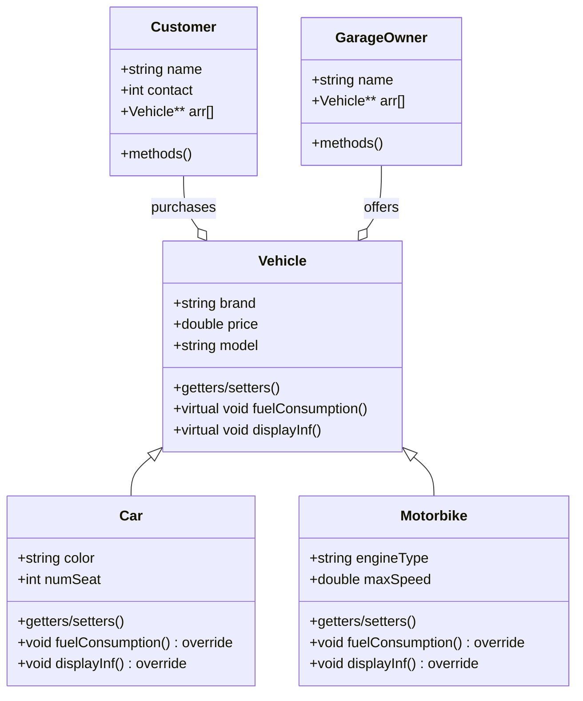

# System Patterns

## System Architecture

The Vehicle Market System is designed around a core class hierarchy with supporting classes that model business entities. The architecture follows object-oriented principles with the following components:

## Key Technical Decisions

1. **Inheritance Hierarchy**: Base `Vehicle` class with specialized `Car` and `Motorbike` derivatives
2. **Polymorphism**: Virtual methods (`displayInf()` and `fuelConsumption()`) for type-specific behaviors
3. **Dynamic Memory Management**: Double pointer arrays (`Vehicle**`) to manage collections of vehicles
4. **Manual Memory Handling**: Explicit constructors and destructors for proper resource management

## Design Patterns in Use

1. **Inheritance Pattern**: Used to establish the vehicle hierarchy
2. **Template Method Pattern**: Base class defines algorithm structure, subclasses provide specific implementations
3. **Composition Pattern**: Customer and GarageOwner classes contain collections of Vehicle objects

## Component Relationships

1. **Vehicle-Car/Motorbike**: "is-a" relationship (inheritance)
2. **Customer-Vehicle**: "has-a" relationship (composition)
3. **GarageOwner-Vehicle**: "has-a" relationship (composition)

## Data Flow

1. GarageOwner creates and maintains an inventory of vehicles
2. Customers can view and purchase vehicles from garage owners
3. Purchased vehicles move from garage owner inventory to customer collection
